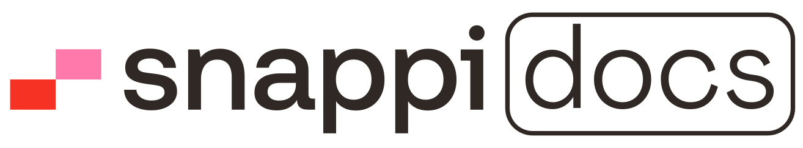

This repository is snappi's Documentation portal template built using [Next.js](https://nextjs.org) and [Tailwind CSS](https://tailwindcss.com).

Please review this README file to get a full grasp of how to assist in contributing to the cause.

## Getting started

To get started with this template, first install the npm dependencies:

```bash
npm install
```

Next, run the development server:

```bash
npm run dev
```

Finally, open <http://localhost:3000> in your browser to view the website.

## Customizing

You can start editing this template by modifying the files in the `/src` folder. The site will auto-update as you edit these files.

## Global search

This template includes a global search that's powered by the [FlexSearch](https://github.com/nextapps-de/flexsearch) library. It's available by clicking the search input or by using the `⌘K` shortcut.

This feature requires no configuration, and works out of the box by automatically scanning your documentation pages to build its index. You can adjust the search parameters by editing the `/src/markdoc/search.mjs` file.

## Learn more

To learn more about the technologies used in this template, see the following resources:

- [Tailwind CSS](https://tailwindcss.com/docs) - the official Tailwind CSS documentation
- [Next.js](https://nextjs.org/docs) - the official Next.js documentation
- [Headless UI](https://headlessui.dev) - the official Headless UI documentation
- [Framer Motion](https://www.framer.com/docs/) - the official Framer Motion documentation
- [MDX](https://mdxjs.com/) - the official MDX documentation
- [Algolia Autocomplete](https://www.algolia.com/doc/ui-libraries/autocomplete/introduction/what-is-autocomplete/) - the official Algolia Autocomplete documentation
- [FlexSearch](https://github.com/nextapps-de/flexsearch) - the official FlexSearch documentation
- [Zustand](https://docs.pmnd.rs/zustand/getting-started/introduction) - the official Zustand documentation

## Code of Conduct

This project has adopted the [Natech/snappi Terms of Service](https://natechgr.sharepoint.com/sites/Intranet/SitePages/Compliance.aspx) that we expect all project participants to adhere to. For more info,contact docs@snappi.com with any additional questions or comments.

## Development Process

**snappi docs** uses Git as its cradle of truth. The core team will be working directly here. All changes will be public from the very beginning.

## Contributors

This project shall flourish thanks to all participants. Let's witness the power of the collective!

## Contributing

The main purpose of this repository is to continue to evolve **snappi docs**,both style & content wise.
